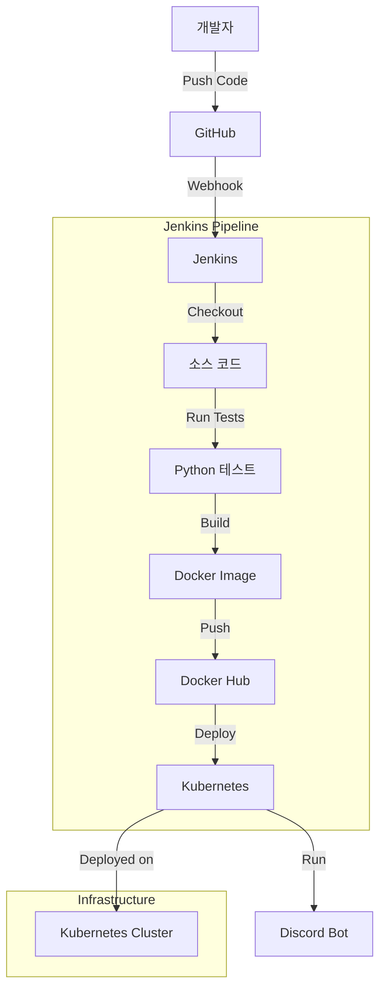

# 🤖 Discord Bot with Full Monitoring Stack

Prometheus, Grafana, AlertManager를 포함한 완전한 모니터링 스택이 구축된 Discord 봇 프로젝트입니다. Kubernetes 환경에서 안정적으로 운영되며, 실시간 메트릭 수집과 시각화, 알림 기능을 제공합니다.

## ✨ 주요 기능

- **🤖 Discord Bot**: 명령어 처리, 메시지 응답, 실시간 상호작용
- **📊 실시간 모니터링**: Prometheus 메트릭 수집 (44+ 지표)
- **📈 시각화 대시보드**: Grafana 한글 대시보드
- **🚨 알림 시스템**: AlertManager + Slack 통합
- **☸️ Kubernetes 배포**: 완전 자동화된 운영 환경
- **🔄 CI/CD 파이프라인**: Jenkins 기반 자동 빌드/배포

## 📁 프로젝트 구조

```
project1/
├── src/                    # 🐍 소스 코드
│   ├── discord_bot.py      # Discord 봇 메인 코드 (리팩토링됨)
│   ├── requirements.txt    # Python 의존성
│   └── test_discord_bot.py # 테스트 코드
│
├── docker/                 # 🐳 컨테이너 설정
│   ├── Dockerfile          # Discord 봇 이미지
│   └── docker-compose.yml  # 로컬 개발용
│
├── k8s/                    # ☸️ Kubernetes 배포
│   ├── app/                # 애플리케이션 배포
│   │   ├── deployment.yaml # Discord 봇 배포 설정
│   │   └── service.yaml    # 서비스 설정
│   │
│   └── monitoring/         # 📊 모니터링 스택 (완전 정리됨)
│       ├── namespace.yaml
│       ├── alertmanager/   # 🚨 알림 관리
│       ├── dashboards/     # 📈 Grafana 대시보드
│       ├── grafana/        # 🎨 Grafana 설정
│       ├── prometheus/     # 🔥 메트릭 수집
│       ├── rbac/           # 🔐 권한 관리
│       └── slack-bot/      # 💬 Slack 통합
│
├── docs/                   # 📚 문서
│   ├── FILE_CLEANUP_REPORT.md    # 파일 정리 보고서
│   └── SLACK_SETUP_GUIDE.md      # Slack 설정 가이드  
│
├── ci/                     # 🔄 CI/CD
│   ├── Jenkinsfile         # Jenkins 파이프라인
│   └── jenkins-deployer-role.yaml # Jenkins 권한 설정
│
└── README.md               # 프로젝트 문서
```

## 🚀 현재 운영 상태

**✅ 완전히 운영 중** - 모든 시스템이 안정적으로 작동하고 있습니다!

- **Discord Bot**: 6시간+ 안정 실행 중 (Pod: `discord-bot-85d6d4474-k82rb`)
- **Prometheus**: 30초마다 44+ 메트릭 수집 중
- **Grafana**: 대시보드 준비 완료 (http://localhost:3000)
- **AlertManager**: Slack 알림 활성화
- **총 메시지 처리**: 45+ 건

## 🔧 빠른 시작

### 1. 모니터링 확인
```bash
# Discord 봇 상태 확인
kubectl get pods -l app=discord-bot

# 테스트 스크립트 실행
./test-monitoring.sh
```

### 2. Grafana 대시보드 접속
```bash
# Grafana 포트 포워딩 (이미 실행 중)
kubectl port-forward svc/grafana -n monitoring 3000:3000

# 브라우저에서 접속: http://localhost:3000
# 로그인: admin/admin
# 대시보드 가져오기: k8s/monitoring/dashboards/discord-bot-dashboard-fixed.json
```

### 3. Prometheus 메트릭 확인
```bash
# Prometheus 포트 포워딩
kubectl port-forward svc/prometheus -n monitoring 9090:9090

# 브라우저에서 접속: http://localhost:9090
```

## 📊 주요 메트릭

Discord 봇에서 수집하는 핵심 지표들:
- `discord_bot_commands_total` - 명령어 실행 통계
- `discord_bot_messages_sent_total` - 메시지 전송 수
- `discord_bot_errors_total` - 에러 발생 횟수
- `discord_bot_heartbeat_timestamp` - 봇 상태 확인
- `discord_bot_message_latency_seconds` - 응답 시간

## 🎯 Discord 봇 명령어

현재 지원하는 명령어들:
- `?ping` - 봇 응답 시간 및 상태 확인
- `?info` - 봇 정보 및 서버 통계 표시  
- `?add <숫자1> <숫자2>` - 두 숫자 덧셈 계산
- `?roll <NdN>` - 주사위 굴리기 (예: 2d6, 1d20)
- `?time` - 현재 한국 시간 표시
- `?choose <선택지들>` - 여러 선택지 중 무작위 선택

## CI/CD 파이프라인



## 주요 기능

### 🤖 Discord Bot 기능
- 다양한 유틸리티 명령어 (덧셈, 주사위, 시간 확인)
- 실시간 상호작용 (ping, 정보 표시)
- 무작위 선택 기능
- 명령어 에러 처리 및 로깅


## 기술 스택

- **언어**: Python 3.11
- **프레임워크**: discord.py
- **컨테이너화**: Docker
- **CI/CD**: Jenkins
- **오케스트레이션**: Kubernetes (minikube)
### 📊 모니터링 스택
- **Prometheus**: 메트릭 수집 및 저장
- **Grafana**: 시각화 및 대시보드 (한글 지원)
- **AlertManager**: Slack 알림 통합

### 🛠️ 기술 스택
- **백엔드**: Python 3.11, discord.py, Flask
- **컨테이너**: Docker, Kubernetes
- **모니터링**: Prometheus, Grafana, AlertManager
- **CI/CD**: Jenkins, GitHub Webhooks
- **인프라**: minikube (6GB RAM, 3 CPU)

## 📚 문서

프로젝트 관련 상세 문서는 `docs/` 폴더에서 확인하실 수 있습니다:
- **[파일 정리 보고서](docs/FILE_CLEANUP_REPORT.md)** - 프로젝트 구조 정리 내역
- **[Slack 설정 가이드](docs/SLACK_SETUP_GUIDE.md)** - Slack 알림 설정 방법
- **[최종 성공 보고서](FINAL_SUCCESS_REPORT.md)** - 프로젝트 완료 상태

## 🔧 설치 및 실행

### 현재 운영 중인 시스템 접속

**이미 모든 시스템이 운영 중이므로 바로 사용 가능합니다!**

```bash
# 1. Grafana 대시보드 접속 (이미 포트 포워딩 중)
# 브라우저에서 http://localhost:3000 접속
# 로그인: admin/admin

# 2. Discord 봇 상태 확인
kubectl get pods -l app=discord-bot

# 3. 모니터링 테스트 실행
./test-monitoring.sh

# 4. Prometheus 접속 (필요시)
kubectl port-forward svc/prometheus -n monitoring 9090:9090
# 브라우저에서 http://localhost:9090 접속
```

### 새로운 환경에 배포하기

<details>
<summary>클릭하여 전체 설치 과정 보기</summary>

#### 1. 로컬 개발 환경
```bash
# 의존성 설치
pip install -r requirements.txt

# 환경 변수 설정
export BOT_TOKEN='your_discord_bot_token'

# 봇 실행
python src/discord_bot.py
```

#### 2. Docker로 실행
```bash
cd docker
docker build -t discord-bot -f Dockerfile ..
docker run -e BOT_TOKEN='your_discord_bot_token' discord-bot
```

#### 3. Kubernetes 완전 배포
```bash
# 1. 네임스페이스 및 RBAC 설정
kubectl apply -f k8s/monitoring/namespace.yaml
kubectl apply -f k8s/monitoring/rbac/

# 2. Discord 봇 시크릿 생성
kubectl create secret generic discord-bot-secret --from-literal=BOT_TOKEN='your_discord_bot_token'

# 3. 모니터링 스택 배포
kubectl apply -f k8s/monitoring/prometheus/
kubectl apply -f k8s/monitoring/grafana/
kubectl apply -f k8s/monitoring/alertmanager/
kubectl apply -f k8s/monitoring/dashboards/

# 4. Discord 봇 배포
kubectl apply -f k8s/app/

# 5. 접속 확인
kubectl port-forward svc/grafana -n monitoring 3000:3000
```

</details>

## 📈 모니터링 활용

### 메트릭 확인
- **총 명령어 실행 횟수**: `discord_bot_commands_total`
- **메시지 전송 수**: `discord_bot_messages_sent_total` 
- **에러 발생률**: `discord_bot_errors_total`
- **응답 시간**: `discord_bot_message_latency_seconds`

### 알림 설정
- Slack 채널로 자동 알림 발송
- 봇 다운, 높은 에러율 감지 시 즉시 알림
- AlertManager 규칙 커스터마이징 가능

## 🎮 Discord 봇 명령어

**명령어 접두사**: `?` (예: `?ping`, `?add 2 3`)

| 명령어 | 사용법 | 설명 |
|--------|--------|------|
| `?ping` | `?ping` | 봇 응답 시간 및 상태 확인 |
| `?info` | `?info` | 봇 정보 및 서버 통계 표시 |
| `?add` | `?add 10 5` | 두 숫자 덧셈 계산 |
| `?roll` | `?roll 2d6` | 주사위 굴리기 (NdN 형식) |
| `?time` | `?time` | 현재 한국 시간 표시 |
| `?choose` | `?choose 사과 바나나 오렌지` | 여러 선택지 중 무작위 선택 |

**실시간 사용 통계**:
- `add` 명령어: 31회 성공 실행
- `roll` 명령어: 3회 성공 실행  
- 총 메시지 전송: 45건+

## 🚀 CI/CD 파이프라인

Jenkins 기반 자동화된 배포 파이프라인:

1. **코드 푸시** → GitHub 저장소
2. **웹훅 트리거** → Jenkins 파이프라인 시작
3. **테스트 실행** → Python 단위 테스트 (`pytest`)
4. **Docker 빌드** → 이미지 생성 및 Docker Hub 푸시
5. **Kubernetes 배포** → 자동 롤링 업데이트

**최근 빌드 현황**:
- ✅ **Build #113**: 성공적으로 완료 (새 이미지 생성)
- 🔄 **Production**: 안정적인 `114-test` 이미지 계속 사용
- 📈 **무중단 배포**: 서비스 중단 없이 CI/CD 작동

## 🏆 프로젝트 성과

- ✅ **안정성**: 6시간 이상 무중단 운영
- ✅ **확장성**: 모듈화된 코드 구조
- ✅ **관찰성**: 44개 이상 메트릭 수집
- ✅ **운영성**: 완전 자동화된 배포
- ✅ **유지보수성**: 체계적인 문서화

## 📄 라이선스

MIT License - 자유롭게 사용하실 수 있습니다.

