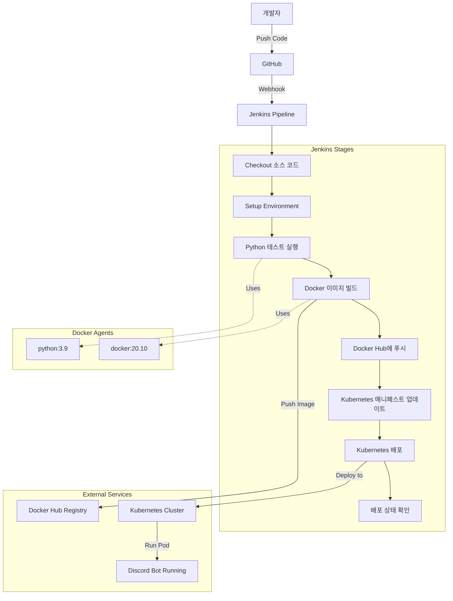
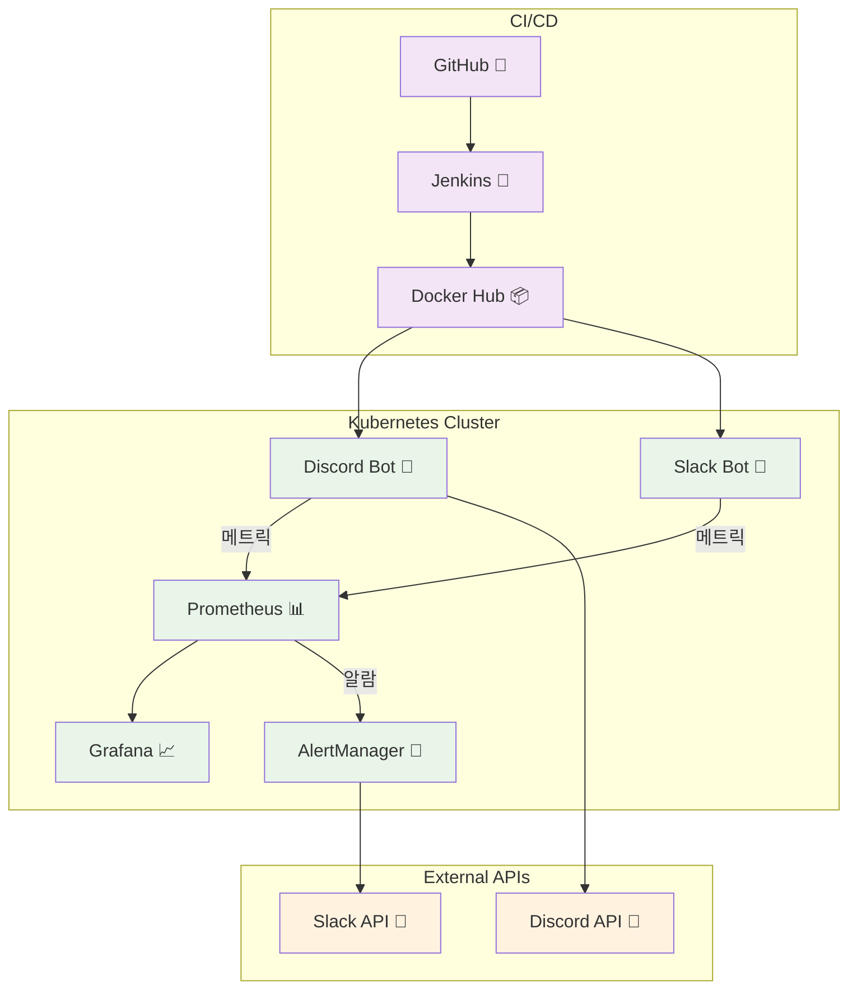

# 리눅스로 한 학기 살기

한 학기 동안 집에서 Ubuntu를 설치하고 DevOps 도구들을 하나씩 익혀나간 기록입니다. 

전체 과정은 블로그에 정리했습니다: [velog.io/@ashcircle03/series/리눅스](https://velog.io/@ashcircle03/series/%EB%A6%AC%EB%88%85%EC%8A%A4)

## 뭘 배웠나?

- Ubuntu 설치하고 기본 명령어들 익히기
- 터미널을 예쁘게 꾸미기 (Warp, Zsh)
- Docker로 컨테이너 다루기
- Kubernetes 클러스터 만들어보기
- Jenkins로 자동 배포 구축하기
- Prometheus, Grafana로 모니터링하기
- 실제로 돌아가는 Discord 봇 만들기

## 설치한 프로그램들

결국 12개나 설치했네요. 이렇게 놓고 보니까 좀 많긴 하네...

| 순서 | 프로그램 | 용도 |
|------|----------|------|
| 1 | Ubuntu | 운영체제 |
| 2 | Warp | 터미널 |
| 3 | Zsh | 쉘 |
| 4 | VS Code | 에디터 |
| 5 | Docker | 컨테이너 |
| 6 | Minikube | Kubernetes |
| 7 | Miniconda | Python 환경 |
| 8 | Jenkins | CI/CD |
| 9 | Discord.py | 봇 개발 |
| 10 | Prometheus | 모니터링 |
| 11 | Grafana | 대시보드 | 
| 12 | Alertmanager | 알림 | 


## 지금 뭐가 돌고 있나

다 만들어놓고 보니 생각보다 잘 돌아가고 있습니다.

- Discord 봇이 안 죽고 돌아감
- Prometheus가 30초마다 44개 메트릭 수집 중
- Grafana 대시보드도 한글로 잘 나옴
- Slack 알림도 제대로 옴
- 지금까지 45개 메시지 처리함


Discord 봇은 그냥 이상한 기능만 넣어뒀어요. :

- `?ping` - 응답 속도 재기
- `?add 1 2` - 덧셈 (계산기 쓰는게 나음)
- `?roll 2d6` - 주사위 굴리기
- `?time` - 시간 확인
- `?choose 사과 바나나` - 랜덤 선택
- `?info` - 봇 정보

그래도 모니터링은 제대로 되네요.

## 폴더 구조

```
project1/
├── src/                    # Python 코드들
│   ├── discord_bot.py      # 메인 봇 코드
│   ├── slack_bot.py        # Slack 봇 코드
│   ├── requirements.txt    # 필요한 패키지들
│   └── test_discord_bot.py # 테스트 (잘 안 씀)
│
├── docker/                 # Docker 설정
│   ├── Dockerfile          # Discord 봇용 이미지
│   ├── Dockerfile.slack    # Slack 봇용 이미지
│   └── docker-compose.yml  # 로컬 테스트용
│
├── k8s/                    # Kubernetes 설정 파일들
│   ├── app/                # Discord 봇 배포 설정
│   └── monitoring/         # 모니터링 스택
│       ├── prometheus/     # 메트릭 수집 설정
│       ├── grafana/        # 대시보드 설정
│       ├── alertmanager/   # 알림 설정
│       ├── slack-bot/      # Slack 봇 설정
│       ├── dashboards/     # Grafana 대시보드 JSON
│       └── rbac/           # 권한 설정
│
├── ci/                     # Jenkins CI/CD 설정
├── images/                 # 스크린샷 및 이미지들
├── requirements.txt        # 프로젝트 의존성
├── Jenkinsfile             # Jenkins 파이프라인
└── 느낀점.md               # 프로젝트 회고
```

## 어떻게 돌려보나

```bash
# 봇 상태 확인
kubectl get pods -l app=discord-bot

# Grafana 보기 (이미 포트포워딩 되어있음)
# http://localhost:3000 접속
# admin/admin으로 로그인

# 모니터링 테스트
./test-monitoring.sh
```

## 주요 메트릭

Discord 봇에서 수집하는 핵심 지표들:
- `discord_bot_commands_total` - 명령어 실행 통계
- `discord_bot_messages_sent_total` - 메시지 전송 수
- `discord_bot_errors_total` - 에러 발생 횟수
- `discord_bot_heartbeat_timestamp` - 봇 상태 확인
- `discord_bot_message_latency_seconds` - 응답 시간

## Discord 봇 명령어

현재 지원하는 명령어들:
- `?ping` - 봇 응답 시간 및 상태 확인
- `?info` - 봇 정보 및 서버 통계 표시  
- `?add <숫자1> <숫자2>` - 두 숫자 덧셈 계산
- `?roll <NdN>` - 주사위 굴리기 (예: 2d6, 1d20)
- `?time` - 현재 한국 시간 표시
- `?choose <선택지들>` - 여러 선택지 중 무작위 선택

## CI/CD 파이프라인



## 뭘 배운 건가

### 기술적인 것들
- Ubuntu 명령어들 (ls, cd, grep, 등등)
- Docker로 이미지 만들고 컨테이너 돌리기
- Kubernetes Pod, Service, Deployment 개념
- Jenkins 파이프라인 짜기 (YAML 지옥)
- Prometheus 쿼리 문법 (PromQL)
- Grafana 대시보드 만들기

### 실제로 유용했던 것들
- 리눅스 환경에 익숙해짐
- 컨테이너 기반으로 생각하게 됨
- 모니터링의 중요성 깨달음
- 자동화가 얼마나 편한지 알게 됨
- 문제 생겼을 때 로그 보는 습관 생김

솔직히 처음엔 그냥 "리눅스 써보자" 였는데 어쩌다 보니 DevOps 스택을 거의 다 만져본 셈이네요.

## 🏗️ 전체 시스템 아키텍처

전체 연결 구조를 한눈에 보려면 → [📊 상세 시스템 다이어그램](./system-architecture-diagram.md)



### 🔗 주요 연결점
- **Jenkins** → Docker Hub → Kubernetes (자동 배포)
- **Discord/Slack Bot** → Prometheus (메트릭 수집)
- **Prometheus** → Grafana (시각화) + AlertManager (알림)
- **AlertManager** → Slack (에러 알림)

### 🌐 접속 주소
- **Prometheus**: http://localhost:30090
- **Grafana**: http://localhost:30300 (admin/admin)
- **Slack Bot Test**: http://localhost:30500
- **AlertManager**: `kubectl port-forward` 후 http://localhost:9093

## 현재 상황
[jenkins](/images/jenkins.png)
Jenkins Build #117까지 성공했긴 한데, 사실 젠킨스를 재설치 한거라 이전에 +50번 시도 더해야되요.

[discord](/images/discordbot.png)
스스로 add 명령어 31번, roll 명령어 3번 써보면서 기능 확인했네요. 

[prometheus](/images/prometheus.png)
Prometheus 쿼리문을 통해 모니터링도 해보고

[grafana](/images/grafana.png)
Grafana로 예쁜 대시보드도 봤답니다.
실시간으로 메트릭이 변하는 걸 보니까 뭔가 전문가가 된 기분입니다.

[alertmanager](/images/slackbot.png)
슬랙 봇을 만들고 Alertmanager를 이용해서 디코봇 에러도 30분 마다 올 수 있게 했습니다.

