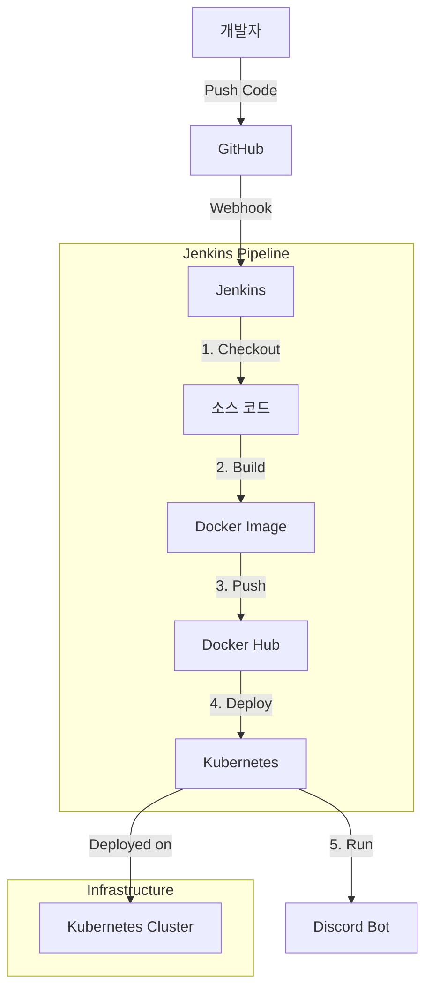

# Discord Bot with CI/CD

Discord 봇을 개발하고 Jenkins와 Kubernetes를 통해 CI/CD 파이프라인을 구축한 프로젝트입니다. 기본 유틸리티 기능을 제공하는 심플한 디스코드 봇입니다.

## 프로젝트 구조

```
project1/
├── src/                    # 소스 코드 디렉토리
│   ├── discord_bot.py      # Discord 봇 메인 코드
│   ├── requirements.txt    # 의존성 패키지 목록
│   └── test_discord_bot.py # 테스트 코드
│
├── docker/                 # 도커 관련 파일
│   ├── Dockerfile          # 디스코드 봇 도커 이미지 설정
│   └── docker-compose.yml  # 도커 컴포즈 설정
│
├── k8s/                    # 쿠버네티스 관련 파일
│   ├── kubeconfig          # 쿠버네티스 설정
│   ├── app/                # 애플리케이션 배포 관련
│   │   ├── deployment.yaml # 디스코드 봇 배포 설정
│   │   └── youtube-api-secret.yaml # API 시크릿
│   │
│   └── monitoring/         # 모니터링 관련 파일
│       ├── prometheus-*.yaml # 프로메테우스 설정 파일들
│       ├── kube-state-metrics-*.yaml # 쿠버네티스 상태 메트릭 설정
│       └── node-exporter-daemonset.yaml # 노드 익스포터 설정
│
├── ci/                     # CI/CD 관련 파일
│   ├── Jenkinsfile         # Jenkins 파이프라인 정의
│   ├── jenkins.Dockerfile  # Jenkins 컨테이너 설정
│   └── jenkins-deployer-role.yaml # Jenkins 권한 설정
│
└── README.md               # 프로젝트 문서
```

## CI/CD 파이프라인



## 주요 기능

- 기본 유틸리티 명령어
  - 시간 확인
  - 주사위 굴리기
  - 선택지 중 무작위 선택
  - 메시지 반복
  - 멤버 정보 확인


## 기술 스택

- **언어**: Python 3.11
- **프레임워크**: discord.py
- **컨테이너화**: Docker
- **CI/CD**: Jenkins
- **오케스트레이션**: Kubernetes (minikube)
- **모니터링**: Prometheus, Grafana

## 개발 환경

- **기본 환경**: Ubuntu 24.04 LTS
- **minikube**: 6GB RAM, 3 CPU 할당
- **Docker**: 28.1.1
- **Jenkins**: 최신 LTS 버전

## 설치 및 실행

### 로컬 개발 환경

1. Python 3.11 설치
2. 의존성 설치:
   ```bash
   pip install -r src/requirements.txt
   ```
3. 환경 변수 설정:
   ```bash
   export BOT_TOKEN='your_discord_bot_token'
   ```
4. 봇 실행:
   ```bash
   python src/discord_bot.py
   ```

### Docker로 실행

```bash
cd docker
docker build -t discord-bot -f Dockerfile ..
docker run -e BOT_TOKEN='your_discord_bot_token' discord-bot
```

### Kubernetes로 배포

1. 시크릿 생성:
   ```bash
   kubectl create secret generic discord-bot-secret --from-literal=BOT_TOKEN='your_discord_bot_token'
   ```

2. 배포:
   ```bash
   kubectl apply -f k8s/app/deployment.yaml
   ```

3. 모니터링 설정 배포:
   ```bash
   # 프로메테우스 배포
   kubectl apply -f k8s/monitoring/prometheus-*.yaml
   kubectl apply -f k8s/monitoring/kube-state-metrics-*.yaml
   kubectl apply -f k8s/monitoring/node-exporter-daemonset.yaml
   
   # 그라파나 배포
   kubectl apply -f k8s/monitoring/grafana-*.yaml
   ```

4. 그라파나 접속:
   ```bash
   # 그라파나 URL 확인
   minikube service grafana --url
   ```
   - 기본 로그인: admin / admin (처음 로그인 후 변경 가능)
   - 프로메테우스 데이터 소스 추가: http://prometheus:9090

## CI/CD 파이프라인

Jenkins 파이프라인은 다음 단계로 구성됩니다:

1. 코드 체크아웃 - GitHub 저장소에서 소스코드 가져오기
2. 테스트 실행 - Python 테스트 케이스 실행
3. Docker 이미지 빌드 및 푸시 - 봇 이미지를 Docker Hub에 업로드
4. 배포 매니페스트 업데이트 - 최신 이미지 태그로 업데이트
5. Kubernetes 배포 - 미니쿼브 클러스터에 배포

## 명령어 목록

- `?time` - 현재 한국 시간 표시
- `?roll [NdN]` - 주사위 굴리기
- `?choose [선택지1] [선택지2] ...` - 선택지 중 무작위 선택
- `?repeat [횟수] [메시지]` - 메시지 반복
- `?add [숫자1] [숫자2]` - 두 숫자 더하기
- `?joined [멤버]` - 멤버의 서버 참가일 확인

## 라이선스

MIT License
=======