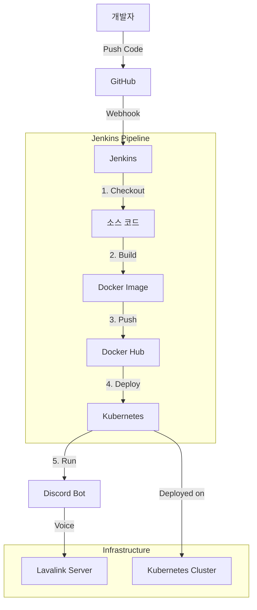

# Discord Bot with CI/CD

Discord 봇을 개발하고 Jenkins를 통해 CI/CD 파이프라인을 구축한 프로젝트입니다.

## 프로젝트 구조

```
project1/
├── .git/                    # Git 저장소
├── requirements.txt         # Python 패키지 의존성
├── discord_bot.py          # Discord 봇 메인 코드
├── lavalink/               # 음성 서버 설정
├── docker-compose.yml      # Docker Compose 설정
├── deployment.yaml         # Kubernetes 배포 설정
├── kubeconfig             # Kubernetes 설정
├── Jenkinsfile            # Jenkins 파이프라인 정의
├── jenkins-deployer-role.yaml  # Jenkins 권한 설정
├── jenkins.Dockerfile     # Jenkins 컨테이너 설정
├── Dockerfile             # Discord 봇 컨테이너 설정
└── README.md              # 프로젝트 문서
```

## CI/CD 파이프라인



## 주요 기능

- 음성 채널 관리 (참가/퇴장)
- YouTube 음악 재생
- 기본 유틸리티 명령어
  - 시간 확인
  - 주사위 굴리기
  - 선택지 중 무작위 선택
  - 메시지 반복
  - 멤버 정보 확인

## 기술 스택

- **언어**: Python 3.11
- **프레임워크**: discord.py, wavelink
- **컨테이너화**: Docker
- **CI/CD**: Jenkins
- **오케스트레이션**: Kubernetes
- **음성 서버**: Lavalink

## 설치 및 실행

### 로컬 개발 환경

1. Python 3.11 설치
2. 의존성 설치:
   ```bash
   pip install -r requirements.txt
   ```
3. 환경 변수 설정:
   ```bash
   export BOT_TOKEN='your_discord_bot_token'
   ```
4. 봇 실행:
   ```bash
   python discord_bot.py
   ```

### Docker로 실행

```bash
docker build -t discord-bot .
docker run -e BOT_TOKEN='your_discord_bot_token' discord-bot
```

### Kubernetes로 배포

1. 시크릿 생성:
   ```bash
   kubectl create secret generic discord-bot-secret --from-literal=BOT_TOKEN='your_discord_bot_token'
   ```

2. 배포:
   ```bash
   kubectl apply -f deployment.yaml
   ```

## CI/CD 파이프라인

Jenkins 파이프라인은 다음 단계로 구성됩니다:

1. 코드 체크아웃
2. Docker 이미지 빌드 및 푸시
3. Kubernetes 배포

## 명령어 목록

- `?join` - 봇을 음성 채널에 참가
- `?leave` - 봇을 음성 채널에서 퇴장
- `?play [검색어]` - YouTube에서 음악 검색 및 재생
- `?time` - 현재 한국 시간 표시
- `?roll [NdN]` - 주사위 굴리기
- `?choose [선택지1] [선택지2] ...` - 선택지 중 무작위 선택
- `?repeat [횟수] [메시지]` - 메시지 반복

## 라이선스

MIT License
=======
