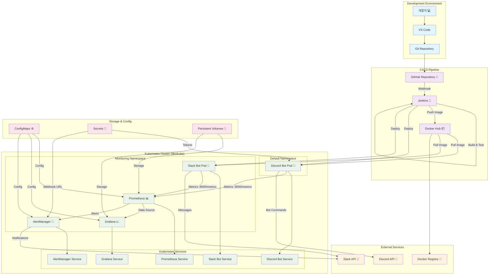
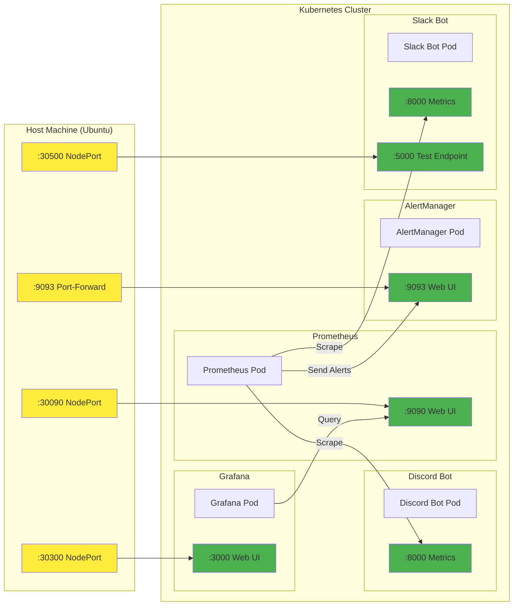
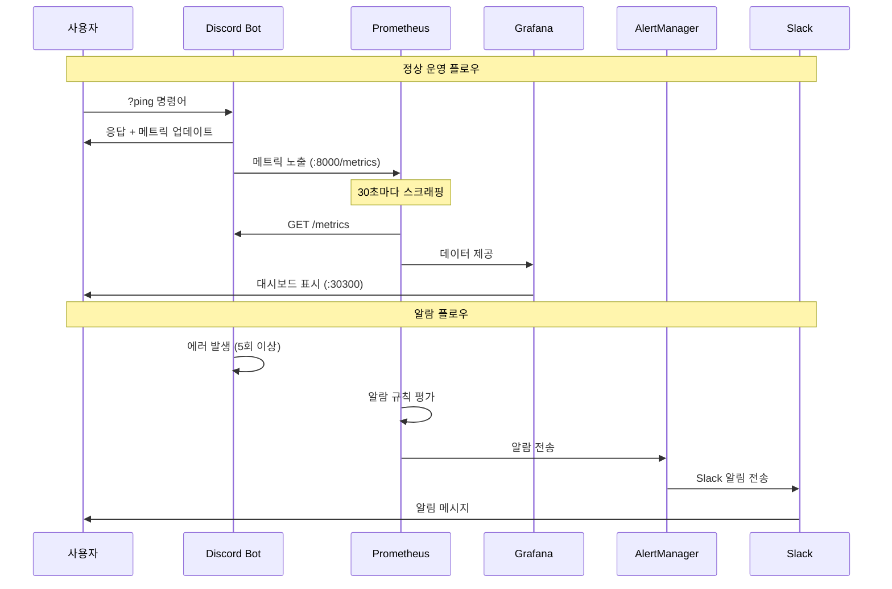
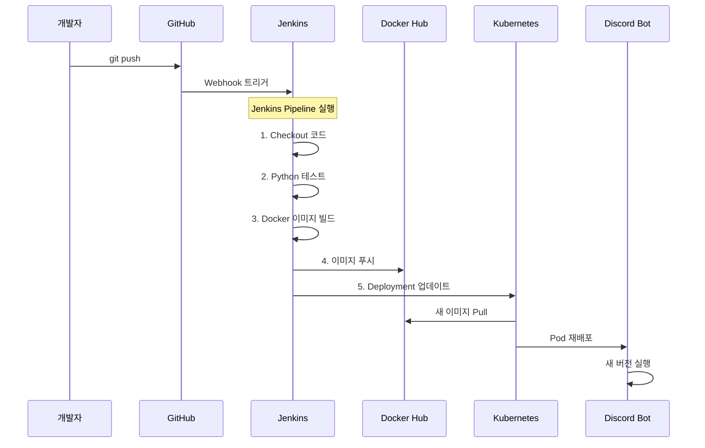

# 리눅스로 한 학기 살기 - 전체 시스템 아키텍처

## 🏗️ 전체 시스템 연결 구조

## 📊 포트 및 네트워크 구성

## 🔄 데이터 플로우

## 🛠️ 배포 플로우

## 📋 주요 연결점 요약

### 1. **개발 → 배포**
- GitHub → Jenkins (Webhook)
- Jenkins → Docker Hub (Image Push)
- Jenkins → Kubernetes (Deployment)

### 2. **모니터링 체인**
- Discord Bot → Prometheus (Metrics :8000)
- Slack Bot → Prometheus (Metrics :8000)
- Prometheus → Grafana (Data Source)
- Prometheus → AlertManager (Alerts)

### 3. **알림 체인**
- Prometheus → AlertManager (Alert Rules)
- AlertManager → Slack (Webhook Notifications)

### 4. **네트워크 접근**
- Prometheus: `localhost:30090`
- Grafana: `localhost:30300`
- Slack Bot Test: `localhost:30500`
- AlertManager: `kubectl port-forward` 필요

### 5. **설정 관리**
- ConfigMaps: Prometheus, Grafana, AlertManager 설정
- Secrets: Discord Token, Slack Webhook URL
- Persistent Volumes: Prometheus, Grafana 데이터 저장

이 구조를 통해 **코드 변경부터 모니터링, 알림까지** 완전 자동화된 DevOps 파이프라인이 구현되어 있습니다! 🚀
